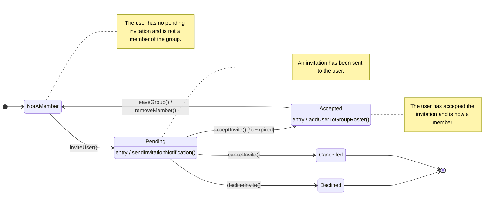

# Group Invitation Lifecycle State Machine

This diagram models the lifecycle of a group invitation, from the moment a user is invited until they become a member, decline, or the invitation is cancelled. It is based on the `UserGroupEntity` and the `InvitationStatus` enum in the `devchat-api`.

## Mermaid Diagram

## Explanation based on UML Concepts

This diagram uses several key concepts from UML State Machine diagrams:

*   **Initial and Final States (`[*]`)**: The diagram starts with an initial state (a filled circle) before any invitation exists and ends in a final state (a circle with a dot) if an invitation is declined or cancelled.

*   **States**: These are the rounded rectangles representing the status of the invitation:
    *   **NotAMember**: The default state before an invitation is sent or after a user leaves a group.
    *   **Pending**: The state after an invitation has been sent but before the user has responded.
    *   **Accepted**: The state reached when the user accepts the invitation. This signifies they are now a group member.
    *   **Declined**: A terminal state if the user rejects the invitation.
    *   **Cancelled**: A terminal state if the inviter revokes the invitation before it is accepted or declined.

*   **Transitions**: These are the arrows that show the path from one state to another.

*   **Events (Triggers)**: Each transition is triggered by an event, which corresponds to a function call in your API (e.g., `inviteUser()`, `acceptInvite()`).

*   **Entry Actions**: We have specified actions that are executed automatically upon entering a state. For example, `entry / sendInvitationNotification()` means that when the invitation enters the `Pending` state, a notification should be sent to the invited user.

*   **Guard Condition**: The transition from `Pending` to `Accepted` includes a guard condition: `[!isExpired]`. This means the `acceptInvite()` event will only successfully transition the state to `Accepted` if the invitation has not expired.
