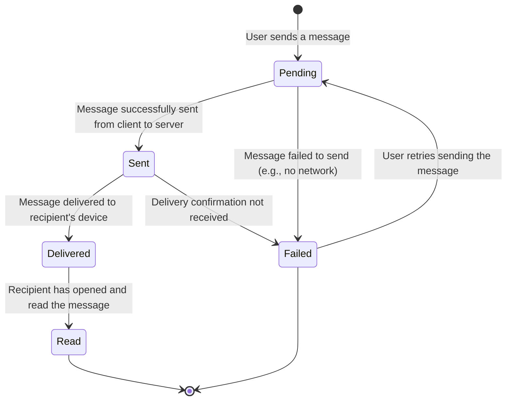

# Message Status State Machine

This document illustrates the lifecycle of a message in the DevChat system using a state machine diagram.

## Mermaid Diagram

## Explanation

This diagram shows the different states a message can be in and how it moves from one state to another.

### States:
- **Pending**: The initial state when a user composes and sends a message. The client is waiting for a confirmation from the server.
- **Sent**: The server has successfully received the message from the sender's client.
- **Delivered**: The message has been successfully delivered to the recipient's client, but they have not yet seen it.
- **Read**: The recipient has opened the chat and viewed the message.
- **Failed**: An error occurred at some point in the process (e.g., network issue, server error).

### Transitions (The Arrows):
- A message moves from `Pending` to `Sent` when the server acknowledges it.
- It moves from `Sent` to `Delivered` when the recipient's device confirms receipt.
- It moves from `Delivered` to `Read` when the recipient actually views it.
- If something goes wrong, the state can become `Failed`. From `Failed`, a user might be able to retry, moving the state back to `Pending`.
- The `[*]` symbols represent the start and end points of the lifecycle.
